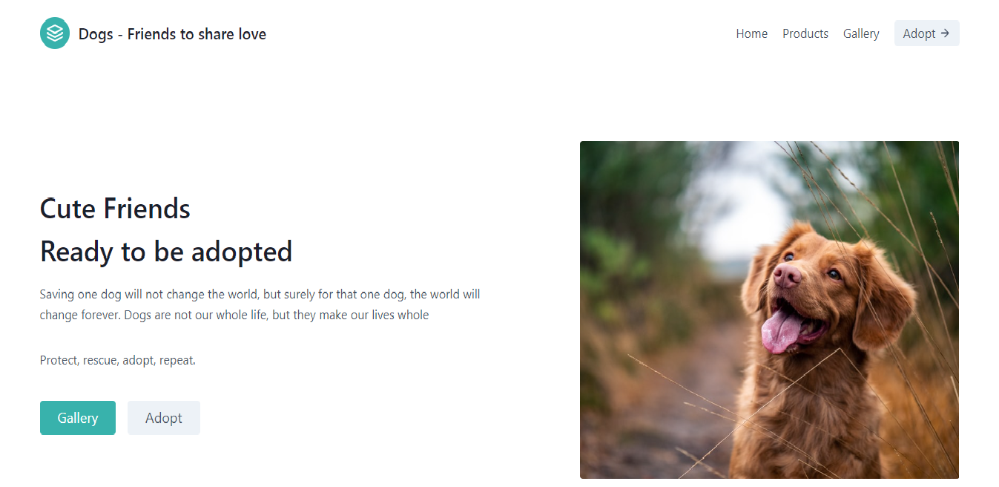

# Dog-Adoption-Site
A website where you can adopt different breeds of Dogs and we can buy merch for them also.

# Problem Statement
Due to large number of dogs residing in the shelters without any family to take care of them, many are losing their lives and the owner of the shelters are also facing financial problems. Due to slow processes and lack of communication, this problem will still goes on.

# Solution 
As almost we all are pet person, and we don't want to see any other in any kind of suffering. So to initiate the  command and to help the rescued dogs to get their dream home, I have build a website where we can adopt any dog with an ease, without any interference we can talk or communicate directly to the owner of the shelter to rescue the particular we want . This can make dogs and the shelter owner's life far easier. You can buy toys for them also from this site.

## Deployed Site
[WebSite](http://adoption-site.azurewebsites.net/)

## Interface



## Steps to contribute
In order to contribute to this project, follow the steps below:
- Fork the project, using the gray `Fork` button in the top right of this page
- Clone your forked repository
  ```bash
  git clone https://github.com/<Username>/Dog-Adoption-Site.git
  ```
- Create a branch in your local repository to make your changes in
  ```git
  git checkout -b your-branch
  ```
- After making changes in your local repository, add the files changed
  ```git
  git add file-name
  ```
- Commit changes when you are satisfied. Refer to [Commit Guidelines](#commit-guidelines)
  ```git
  git commit -am "<message>"
  ```
- Push changes to your remote forked repository
  ```git
  git push -u origin your-branch
  ```
- Go back to your repository and submit a Pull Request with the commits you want to merge with the project
- Follow up with the comments in your pull requests until it is merged

## Commit guidelines
Use the following commit category at the beginning of your message, to make commits easy to follow:
- **feat** - for new features
- **fix** - for defects or bugs
- **chore** - for changes that don't alter the source, but necessary
- **ci** - for ci pipeline changes
- **docs** - for documentation changes
- **perf** - for performance enhancements
- **refactor** - for refactors; altering the code, but not changing functionality
- **revert** - reverting changes
- **style** - for cosmetic changes
- **test** - for unit tests
